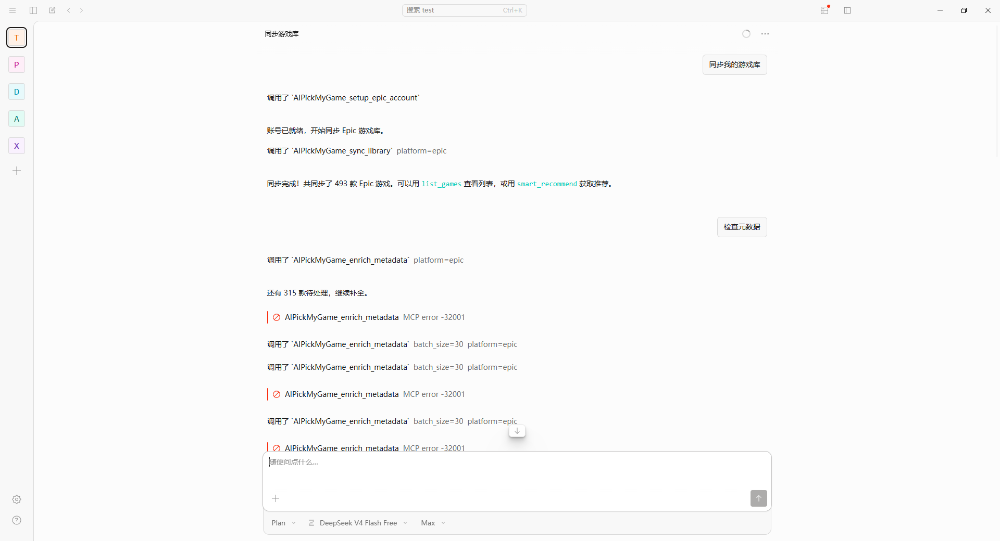
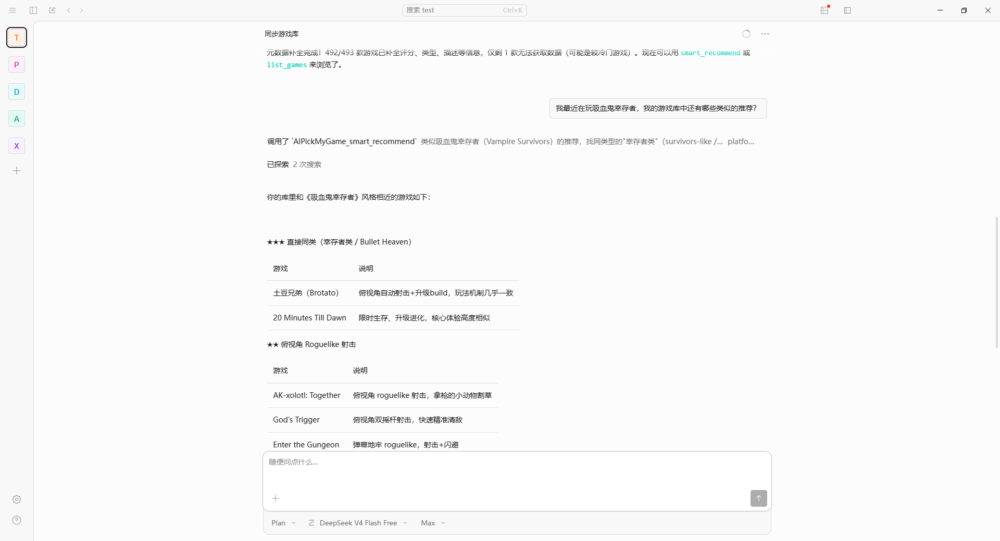
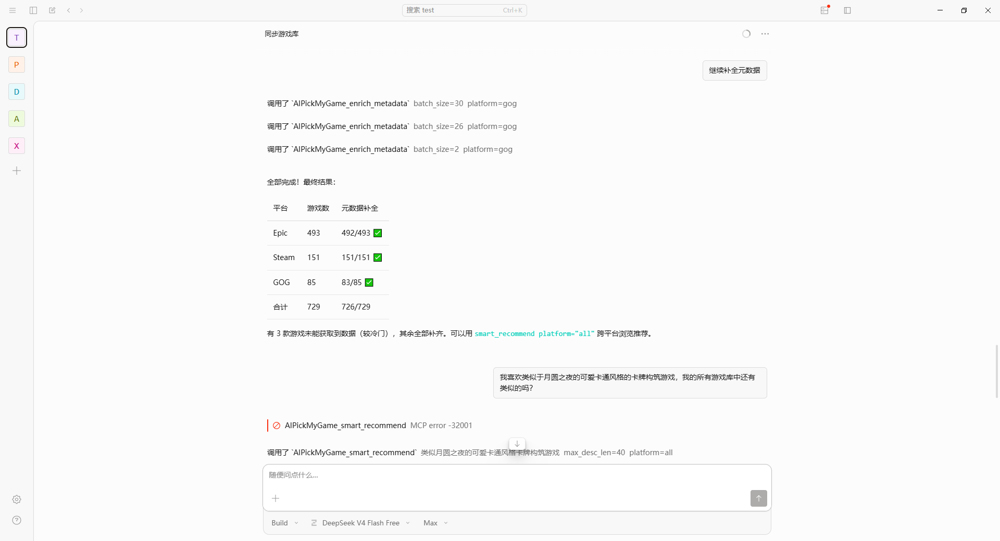
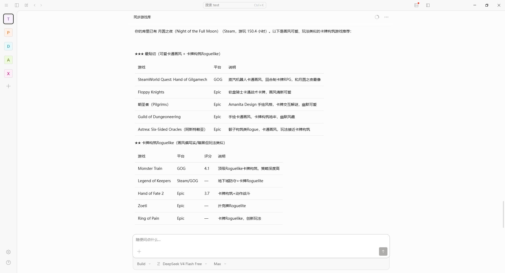

# AIPickMyGame MCP Server

> 一个基于 Model Context Protocol (MCP) 的智能游戏推荐系统：安全同步你的 Epic / GOG / Steam（及 GOG Galaxy 聚合的全平台）游戏库，自动补全中文元数据，再让 AI Agent 用自然语言帮你回答「我现在该玩什么」。

---

## 一、为什么做这个项目（痛点）

众所周知，Epic坚持每周赠送没按费游戏已有数年，Steam平台拥有众多优质的免费小游戏，通过亚马逊会员也能低价获得Epic和GOG的很多游戏，日积月累游戏库变得非常庞大（目前作者本人Epic平台就有 **493 款**）。但真正想玩的时候却很头疼：

- **译名杂乱**：游戏名中英文混杂，有的还用开发代号，根本认不出是什么游戏。
- **筛选机制弱**：平台自带的分类和筛选很弱，几百款游戏里翻不到想玩的。
- **缺乏决策支持**：没有「按心情/时长/类型推荐」的能力，面对一长串列表无从下手。

一句话：**游戏很多，却不知道玩什么。**

我们需要一个工作流，能安全地拿到游戏库、把杂乱数据清洗成规整的中文元数据，再通过自然语言交互做精准推荐。

---

## 二、参考了哪些开源项目

| 项目 | 借鉴点 |
|------|--------|
| [Legendary](https://github.com/derrod/legendary) | 成熟的 Epic Games 第三方客户端。直接复用它的认证与游戏库 API，避免自己硬拼 Epic OAuth 参数 |
| [Heroic Games Launcher](https://github.com/Heroic-Games-Launcher/HeroicGamesLauncher) | ① 登录方案：不硬编码 Epic 登录参数，改用 Legendary 维护的 `legendary.gl/epiclogin` 辅助页获取 authorizationCode。② GOG 支持：复刻其 `gogdl` 的 OAuth2 流程（client_id/secret、token endpoint、galaxy-library API 全部公开），用纯 Python httpx 实现，不引入二进制依赖 |

---

## 三、最终采取的方案

核心思路：**全程国内直连，不需要代理、不需要 root、不需要逆向。**

```
┌─────────────────────────────────────────┐
│  AI Agent (Claude Desktop / OpenCode 等)  │  ← 负责调用 LLM、生成推荐
└──────────────────┬──────────────────────┘
                   │ MCP Tool Call (stdio)
                   ▼
┌─────────────────────────────────────────┐
│       AIPickMyGame MCP Server            │  ← 只做数据：不需要 LLM API Key
│                                          │
│  1. 认证同步  Epic/GOG/Steam/Galaxy 多平台 │
│  2. 元数据    Steam Store（中文，直连）    │
│  3. 数据处理  筛选 / 统计 / 格式化         │
└─────────────────────────────────────────┘
```

**关键决策：**

1. **认证与同步：四条路线按需选用** —— Epic 用 Legendary，GOG 复刻 Heroic 的 gogdl OAuth2，Steam 用官方 Web API（含游玩时长），还能借 GOG Galaxy 聚合库一次拿全平台。均国内直连，登录走官方/社区辅助页，不硬编码平台参数。各路线的取舍详见 [第五章对比表](#五各同步方法对比该选哪个)。
2. **元数据主源换成 Steam Store** —— Steam 商店 API 国内可直连，且 `appdetails` 接口能返回**简体中文**的类型、描述、截图、封面、评分。地理感知降级链：
   - 国内：**Steam → RAWG（需代理）→ IGDB**
   - 海外：RAWG → Steam → IGDB
3. **MCP 只做数据，不调 LLM** —— LLM 调用交给 AI Agent，本服务无需配置任何模型 Key，纯本地、可审计、保护隐私。

---

## 四、达到的效果

- ✅ **同步快**：Legendary 直连，493 款 Epic 游戏几秒同步，不再超时失败。
- ✅ **多平台**：Epic（Legendary）、GOG（Galaxy OAuth2）、Steam（Web API，含游玩时长），还能借 GOG Galaxy 聚合库一键拉取全平台（Steam/Epic/Uplay/Xbox/Origin）。
- ✅ **中文元数据**：Steam Store 返回简体中文类型/描述/截图/封面/评分。
- ✅ **无需代理/root**：全程国内直连。
- ✅ **AI 推荐**：自然语言「周末想玩个轻松的 Roguelike」即可得到基于本地游戏库的精准推荐。

补全效果示例（真实数据）：

---

## 截图展示

以下是单平台与跨平台推荐的实际效果：

### 单平台同步与推荐

<p>
  
</p>

<p>
  
</p>

### 多平台同步与推荐

<p>
  
</p>

<p>
  
</p>

---

> ⚠️ **已知限制**：Steam Store 有 IP 级限流，补全大量游戏时请分批进行（`enrich_metadata` 的 `batch_size` 参数，建议 10~15 一批）。少数游戏因 Steam 已下架或 Epic 独占而匹配不到，属正常。

---

<!-- USAGE_PLACEHOLDER -->

## 五、各同步方法对比（该选哪个）

四种同步方式各有取舍，按你的需求选：

| 方法 | 命令 | 拿到什么 | 需要的凭证/前提 | 游玩时长 | 优点 | 缺点 |
|------|------|----------|----------------|:---:|------|------|
| **Epic** | `sync_library("epic")` | Epic 全部游戏 | 浏览器登录一次（authorizationCode） | ❌ | 复用 Legendary，直连快（493 款几秒）；登录稳定 | 仅 Epic |
| **GOG** | `sync_library("gog")` | GOG 自家游戏 | 浏览器登录一次（OAuth2） | ❌ | 平台独立、数据干净；纯 httpx 无二进制依赖 | 仅 GOG 自家（不含聚合的其他平台） |
| **Steam** | `sync_library("steam")` | Steam 全部拥有的游戏 | 申请 Web API Key + SteamID + Profile 公开 | ✅ | **唯一能拿游玩时长**；自带 appid，封面直连 CDN；不依赖第三方 | 要手动申请 Key；Profile 必须公开 |
| **Galaxy 聚合** | `sync_library("galaxy")` | 你在 GOG Galaxy 绑定的**全平台**游戏（Steam/Epic/Uplay/Xbox/Origin…） | 仅需 GOG 登录 | ❌ | **一个登录拿全平台**，连 Uplay/Xbox/Origin 都白捡（469 款实测） | 依赖你在 GOG Galaxy 里的实际绑定；无时长；与单平台同步数据重叠 |

**怎么选：**

- **只玩 Epic / 只玩 GOG** → 用对应的单平台同步，最干净。
- **重度 Steam 用户、想按「玩得多」推荐** → 用 `steam`，游玩时长会进推荐摘要。
- **多平台党、嫌一个个登录麻烦** → 用 `galaxy`，登录一次 GOG 拿全部（前提是你平时用 GOG Galaxy 管理各平台）。
- **既要全平台又要 Steam 时长** → `galaxy` + `steam` 各跑一次，按 `platform` 字段各取所需。

> 元数据补全（`enrich_metadata`）对**所有平台**通用，统一走 Steam Store 中文方案，与同步方式无关。

---


## 六、如何使用

### 1. 前置要求

- Python 3.10+
- 已安装 `legendary-gl`（随依赖一起安装）

### 2. 安装

```bash
git clone https://github.com/yourusername/AIPickMyGame-MCP.git
cd AIPickMyGame-MCP
pip install -r requirements.txt
```

### 3. 在 AI Agent 中配置

本服务使用 **stdio** 传输协议，通过进程间通信与 AI Agent 交互，不暴露网络端口。

**Claude Desktop** —— 编辑 `claude_desktop_config.json`：

```json
{
  "mcpServers": {
    "AIPickMyGame": {
      "command": "python",
      "args": ["-m", "mcp_server.main"],
      "cwd": "/path/to/AIPickMyGame-MCP",
      "env": { "PYTHONIOENCODING": "utf-8" }
    }
  }
}
```

**OpenCode** —— 编辑 `%USERPROFILE%\.config\opencode\opencode.json`：

```json
{
  "$schema": "https://opencode.ai/config.json",
  "mcp": {
    "AIPickMyGame": {
      "type": "local",
      "command": ["E:/minconda/python.exe", "-m", "mcp_server.main"],
      "cwd": "d:/AI Coding/xuanyou/AIPickMyGame-MCP",
      "enabled": true,
      "environment": { "PYTHONIOENCODING": "utf-8" }
    }
  }
}
```

> **Windows 注意事项**：
> - 必须使用 Python 的**完整绝对路径**（如 `E:/minconda/python.exe`），避免 Windows Store 的 0 字节 `python.exe` 存根导致 `EFTYPE` 错误。
> - 必须设置 `PYTHONIOENCODING=utf-8`，否则中文/emoji 会触发 `UnicodeEncodeError`。
> - 路径建议用 `/` 避免转义。
> - OpenCode 用顶级 `"mcp"` 键（非 `"mcpServers"`）、`command` 为数组、环境变量字段名为 `"environment"`，修改后需**完全重启**。

### 4. 首次配置 Epic 账号

在 AI Agent 中按顺序操作：

1. **`setup_epic_account()`** —— 已认证则返回账号信息；未认证则打开浏览器到 `legendary.gl/epiclogin`。
2. 在浏览器中登录 Epic，页面会显示一段 JSON，复制其中的 `authorizationCode`。
3. **`complete_epic_auth("粘贴的 code")`** —— 完成认证。
4. **`sync_library("epic")`** —— 同步游戏库到本地。
5. **`enrich_metadata("epic", batch_size=15)`** —— 补全元数据（多次调用直到全部完成）。

### 5. 配置 GOG 账号（可选）

GOG 流程与 Epic 类似：

1. **`setup_gog_account()`** —— 已认证则返回账号信息；未认证则打开浏览器到 GOG 登录页。
2. 在浏览器中登录 GOG，登录成功后页面会跳转到 `embed.gog.com/on_login_success?code=...`。
3. **复制浏览器地址栏的完整 URL**（或其中 `code=` 后的值）。
4. **`complete_gog_auth("粘贴的 URL 或 code")`** —— 完成认证（工具会自动从 URL 提取 code）。
5. **`sync_library("gog")`** —— 同步 GOG 游戏库。
6. **`enrich_metadata("gog", batch_size=15)`** —— 补全元数据（与 Epic 共用 Steam 中文方案）。

> GOG 登录页**不会**像 Epic 那样把 code 显示在页面上，code 藏在跳转后的地址栏 URL 里，直接复制整个 URL 最省事。

### 6. 配置 Steam 账号（可选）

Steam 同步用官方 Web API，能拿到**全部拥有的游戏 + 游玩时长**（时长对推荐很有用）：

1. 在 https://steamcommunity.com/dev/apikey 申请 Web API Key（域名随便填 `localhost`）。
2. 查到你的 SteamID64（17 位数字，可在 https://steamid.io 查）。
3. 把 Steam 个人资料的『游戏详情』隐私设为**公开**（否则拉不到库）。
4. **`setup_steam_account(api_key, steam_id)`** —— 写入配置。
5. **`sync_library("steam")`** —— 同步游戏库（含游玩时长）。
6. **`enrich_metadata("steam", batch_size=15)`** —— 补全中文元数据。

> Steam 游戏自带 appid，封面直接用官方 CDN 拼接，无需额外请求；游玩时长会出现在 `smart_recommend` 的摘要里，方便 AI 按「你玩得多的类型」推荐。

### 7. 一键聚合全平台游戏库（galaxy，可选）

如果你在 **GOG Galaxy** 里绑定过 Steam / Epic / Uplay / Xbox / Origin 等平台，可以只登录一个 GOG 账号，一次性拉取**全平台**游戏库：

1. 先完成上面的 GOG 认证（`setup_gog_account` + `complete_gog_auth`）。
2. **`sync_library("galaxy")`** —— 通过 GOG Galaxy 聚合库拉取所有已绑定平台的游戏，`platform` 字段标记每款游戏的真实来源（gog/steam/epic/uplay/...）。
3. **`enrich_metadata("galaxy", batch_size=15)`** —— 同样用 Steam 中文方案补全。

> **说明**：聚合库依赖你在 GOG Galaxy 客户端里实际绑定的平台，能拉到多少取决于你绑了哪些。它与单独的 `sync_library("epic")`/`"gog"` 数据会有重叠，按需选用——想要「一个入口看全部」用 `galaxy`，想要「平台独立、数据干净」用各自的平台同步。

### 8. 元数据配置（可选）

编辑 `config/config.json` 的 `metadata` 字段：

```json
{
  "metadata": {
    "provider": "steam",
    "steam_language": "schinese",
    "steam_country": "CN",
    "api_key": "你的 RAWG_API_KEY（海外用户可选）",
    "igdb_client_id": "",
    "igdb_client_secret": ""
  }
}
```

国内用户保持默认即可（Steam 直连中文）。海外用户可在 [rawg.io/apidocs](https://rawg.io/apidocs) 免费注册 RAWG Key（每月 2 万次）。

### 9. 日常使用

直接和 AI Agent 对话：

```
用户: "周末想玩个轻松点的 Roguelike"
AI:   → smart_recommend("epic", "轻松的 Roguelike")
      → 基于你的本地游戏库分析
      → 返回带推荐理由的游戏卡片
```

跨平台推荐——告诉 AI「在所有平台里帮我挑」，它会合并 Epic/Steam/GOG 三个库，并标注每款游戏在哪些平台拥有：

```
用户: "我所有平台里，推荐个买了还没玩的"
AI:   → smart_recommend("all", "买了还没玩的")
      → 合并 epic/steam/gog 全库，每行带 [平台] 标注
      → ◆ exact：确定同款（如 PAYDAY 2 在 epic/steam 都有），直接告诉你「这游戏 X/Y 平台都有，自选版本」
      → ◇ loose：疑似同款（如 BioShock 2 Remastered vs BioShock 2），由 AI 判断是否同款；不确定就如实列出两个版本让你选
```

> 跨平台同款识别采用「程序初筛 + Agent 复判」：程序只把可能相同的游戏分组并标注置信度（exact/loose），最终是否同款、如何向用户呈现交给能理解语义的 AI 判断，不确定的情况会明确告知用户而非悄悄合并。

## 七、工具列表

| 工具 | 参数 | 说明 |
|------|------|------|
| `setup_epic_account()` | 无 | 检查 Legendary 认证状态，未认证时打开浏览器引导登录 |
| `complete_epic_auth(code)` | `authorization_code: str` | 使用 authorizationCode 完成 Epic 认证 |
| `setup_gog_account()` | 无 | 检查 GOG 认证状态，未认证时打开浏览器引导登录 |
| `complete_gog_auth(code)` | `authorization_code: str` | 使用登录跳转 URL 或 code 完成 GOG 认证 |
| `setup_steam_account(api_key, steam_id)` | `api_key: str`, `steam_id: str` | 配置 Steam Web API 凭证（写入 config） |
| `sync_library(platform, force)` | `platform="epic"`, `force=false` | 同步游戏库到本地（`epic`→Legendary，`gog`→Galaxy API，`steam`→Web API，`galaxy`→全平台聚合库） |
| `enrich_metadata(platform, batch_size)` | `platform="epic"`, `batch_size=50` | 补全游戏元数据（评分/类型/描述/截图），支持分批 |
| `get_user_library(platform)` | `platform="epic"` | 获取已同步的游戏库数据 |
| `list_games(platform, genre, search)` | 可选过滤参数 | 列出和筛选游戏 |
| `format_games_for_llm(platform, query, max_games)` | 格式化参数 | 将游戏数据格式化为 LLM Prompt |
| `smart_recommend(platform, query, max_desc_len)` | 推荐参数 | 返回全库紧凑摘要（名称\|类型\|评分\|年份\|标签\|简介，Steam 库额外带游玩时长）。`platform="all"` 进入跨平台模式：合并 epic/steam/gog，标注每款游戏所属平台，并对「疑似同款」做程序初筛（◆exact 确定同款 / ◇loose 疑似需 Agent 复判），供 LLM 深度分析 |

---

## 八、项目结构

```
AIPickMyGame-MCP/
├── mcp_server/              # MCP Server 核心
│   ├── main.py              # FastMCP 入口，定义所有工具
│   ├── config.py            # 配置管理（Pydantic）
│   ├── auth/                # 认证（Epic→Legendary，GOG→OAuth2）
│   ├── sync/                # 游戏库同步（legendary / gog / steam / galaxy 聚合）
│   ├── metadata/            # 元数据补全（Steam 主源 + RAWG/IGDB 降级）
│   ├── recommend/           # 游戏库数据处理（筛选/统计/格式化）
│   └── storage/             # Token 与游戏库缓存
├── browser-extension/       # 浏览器扩展（备用数据提取方案）
├── config/                  # 配置文件和 Token 存储
└── requirements.txt         # Python 依赖
```

### 数据流

```
认证 → 同步 → 补全 → 推荐
 │      │      │      │
 │      │      │      └─ smart_recommend: 全库摘要(含游玩时长) → AI Agent 用 LLM 分析
 │      │      └─ enrich_metadata: Steam(中文) → RAWG → IGDB 降级（全平台通用）
 │      └─ sync_library: epic/gog/steam/galaxy 四选一 → 本地 JSON
 └─ setup_*_account: Epic/GOG 浏览器登录，Steam 填 Key
```

---

## 九、架构说明与 FAQ

**MCP Server 不调用 LLM。** 它只负责数据读取与处理，把结构化游戏库交给 AI Agent，由 Agent 调自己的 LLM 生成推荐。因此本服务**无需配置任何模型 API Key**。

| 问题 | 解答 |
|------|------|
| Token 存在哪里？ | JSON 文件，`config/tokens/` 目录。用文件而非系统密钥链，是因为 Epic 的 refresh token 可能超过 Windows Credential Manager 的 512 字节限制 |
| 认证失败怎么办？ | 删除 `config/tokens/epic_token.json` 或运行 `legendary auth --delete`，重新执行 `setup_epic_account()` |
| 需要 LLM API Key 吗？ | 不需要，LLM 调用由 AI Agent 负责 |
| 如何切换 Epic 账号？ | `legendary auth --delete` 注销后重新认证 |
| Steam 拉不到游戏？ | 确认 ① api_key 正确 ② SteamID64 正确 ③ 个人资料『游戏详情』已设为**公开**（三者缺一不可） |
| Steam Key 申请失败？ | 账号需有一定消费记录/绑定手机令牌才能申请；实在拿不到可改用 `sync_library("galaxy")` 借 GOG 间接拿 Steam 库（但没有游玩时长） |
| API Key 会泄露吗？ | Key 和 token 都存在 `config/config.json` 与 `config/tokens/`，已被 `.gitignore` 排除，不会提交到仓库 |
| 元数据补全很慢/失败？ | Steam 有 IP 级限流，请减小 `batch_size` 分批补全；确认未被系统代理干扰（本服务已对 Steam 强制直连） |
| 推荐结果都是英文名？ | 游戏库标题多为英文（Epic/Steam/GOG 数据源本身不给中文标题，约 95% 为英文）。`smart_recommend` 会在返回数据里带一段给 Agent 的指令：呈现推荐时若确知中文译名就用括号附在英文标题后（如 `Vampire Survivors（吸血鬼幸存者）`），不确定的保持原标题、不编造。是否标注中文由 Agent 的 LLM 决定 |
| 重新同步会丢已补的元数据吗？ | 不会。`sync_library` 每次从平台 API 拉最新游戏列表后，会按 `app_name` 回填本地旧库中已补全的字段（评分/类型/描述/标签/`_meta_source` 等），元数据不丢失。`enrich_metadata` 也是增量：带 `_meta_source`（steam/rawg/igdb）且已有类型+描述的游戏会被跳过，只补未完成的。元数据随库 JSON（`~/Games/{platform}_library.json`）一起持久化，无独立缓存文件 |

---

## 开发

```bash
pytest                  # 运行测试
python verify_setup.py  # 验证项目结构
```

## 许可证

MIT License

